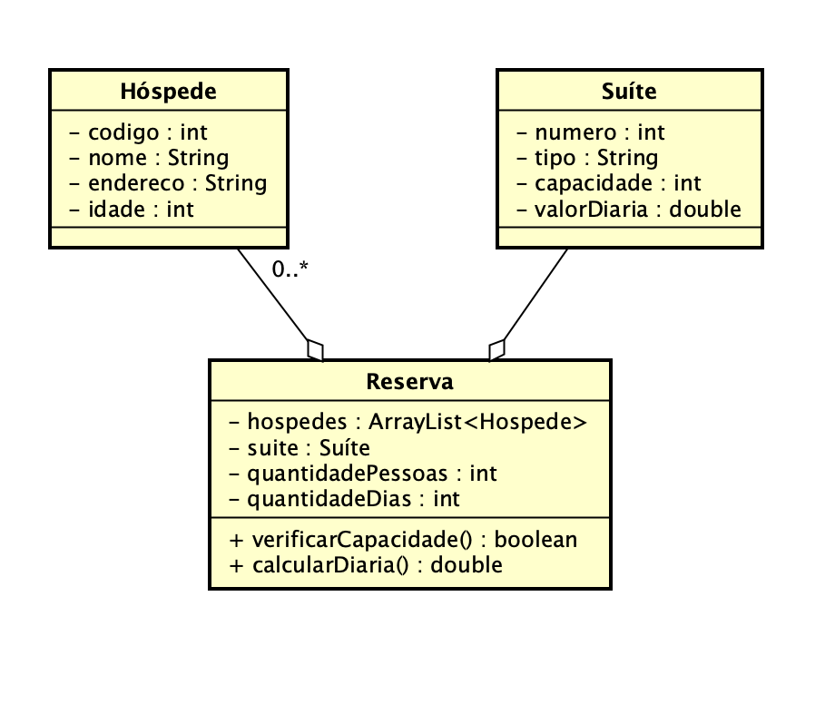

# Reserva Hotel
## Sistema para fazer reservas de Hotelaria - IDE Netbeans

### Esse código foi feito como avaliação final na materia de programação III em Java na faculdade.

Foi solicitado o Seguinte:

Imagine que você trabalha como desenvolvedor de sistemas em uma fábrica de software que tem como novo cliente o dono de um hotel que foi recém inaugurado. O hotel necessita de um sistema de reserva de hospedagem para gestao das vagas nas suítes, o analista de sistemas já fez a modelagem do sistema como demonstrado abaixo:

imagen fluxograma da situação!

Além da modelagem disponível para implementação, temos também alguns requisitos funcionais que são:
1 - A reserva não pode alocar mais hóspedes do que a capacidade da suíte.
2 - Bebês até 2 anos não contam na capacidade da suíte.
3 - Para o cálculo da diária, multiplique o valor da diária da suíte pela quantidade de diárias solicitadas.
4 - Para um reserva com mais de 7 dias, deverá ser concedido um desconto de 10%

Tendo o diagrama e os requisitos funcionais do sistema, implemente um projeto utilizando Java na IDE Netbeans contendo as classes, bem como seus atributos e métodos, aplicando as regras e os conceitos da Orientação a Objetos. A implementação não necessita de interface para entrega, poderá ser criado uma classe "Main" que instancie e execute os objetos e métodos para o teste das funcionalidades. Logo após compacte o projeto e envie para correção.

Entendo que possa haver a preferência por diferentes IDEs, entretanto para esta atividade é necessário que seja criado em um projeto utilizando NetBeans para que padronize e facilite a correção.

